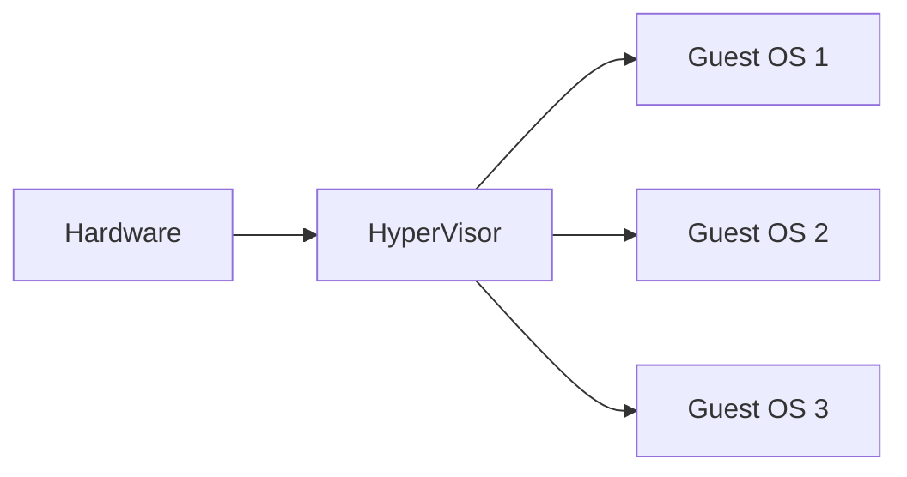
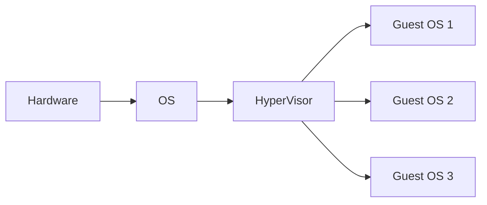

---
tags:
  - SO
  - Librerie
  - C
  - Compilatore
  - MacchineVirtuali
---
- Utente e programmi
- Sistema operativo -----
- Gui
- System calls
	- Chiamate di sistema
- Servizi
	- Allocazione risorse (ram)
	- I/O
	- file system
	- Accounting
- Sistema operativo -----
- Hardware

Formati di file system
	Windows NTFS
Formati di file system sono:
	"lenti"
	occupano spazio
	sono più sicuri
Infatti per le usb si usano altri tipi di file system

# Librerie Dinamiche
DLL sono pezzi di codice già compilati in codice macchina che non possono essere eseguite direttamente ma devono essere attaccate da un altro programma
Le libre dinamiche sono caricate in memoria solo quando il main chiama la funzione dentro il dll
I dll sono caricati dallo Stub
### Stub
Lo stub è una funzione che si occupa di "chiamare" per caricare in memoria la libreria
# Librerie Statiche
Pezzi di codice importati nel main che fanno parte della [[5.1 Layout di un processo#Text section|Text Section]] essendo compilati dentro l'output (quindi l'eseguibile)
# Compilazione C
- *Input* (main.c)
- Compilatore
- *Output* (main.o)
- Linker (Aggiunge le librerie)
	- Dinamico
	- Statico
- *File eseguibile*
# Sistemi operativi monolitici
Unico eseguibile caricato tutto in memoria
Ha molti problemi
	Per aggiornare bisogna aggiornare tutto il sistema
	Deve caricare tutto sulla ram in una volta
Ma è molto veloce
# Microkernels
Funzionalità kernel spostate fuori dell kernel in user mode per evitare problemi di stabilità causati dalle funzionalità
Per evitare blocchi del kernel
Molto piccolo
# MacOS e iOS
Basati su darwin
# Macchine virtuali
Software che permette di emulare un sistema operativo non presente sulla macchina fisica
## HyperVisor (HW)
Gira le chiamate del sistema operativo emulato e le traduce in chiamate eseguibili dal sistema operativo base
### HW tipo 1
Migliore gestione risorse
Efficiente
Molto complicato
Tutte le chiamate dei guest passano dall' hypervisor che parla direttamente con l'hardware  

### HW tipo 2
Più lento in quanto c'è il sistema operativo in mezzo

### HyperVisor di windows
Misto tra HW 1 e HW 2
I guest non passano da windows ma vanno direttamente all'hypervisor e hardware
![[Pasted image 20231214125348.png]]