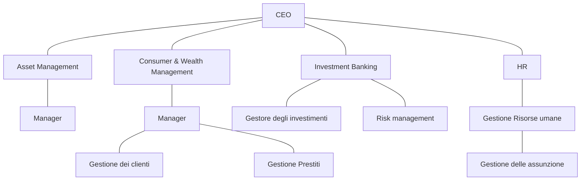

Creazione organigramma di una azienda:
Azienda di servizi, Divisionale

```mermaid
flowchart TD
CEO --- A[Asset Management]
A --- D[Manager]
CEO --- B[Consumer & Wealth Management]
B --- E[Manager]
E --- H[Gestione dei clienti]
E --- P[Gestione Prestiti]
CEO --- C[Investment Banking]
C --- F[Gestore degli investimenti]
C --- G[Risk management]
CEO --- I[HR]
I --- X[Gestione Risorse umane]
X --- K[Gestione delle assunzione]
```
