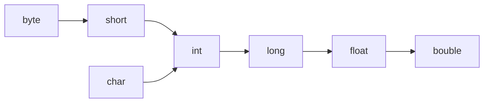
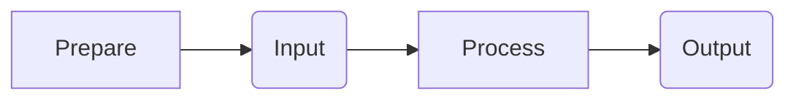

---
tags:
  - Java
---
# Struttura
Tutto il programma in classi 
>[!warning] Nome delle classi
>Il nome della classe deve essere uguale al nome del file in cui è contenuto

Nomi delle classi in Pascal Case
Prima lettera maiuscola
```EsempioPascalCase
NomeClasse
```
## main
Ogni progetto deve avere un main
main entry point
```java
public class NomeClasse{
	public static void main(String[] args){
		
	}
}
```
## Identificatori
Nome di qualsiasi variabile, classe, ecc.
- Solo lettere o _ o $ 
- No numeri
- No keyword
- No spazi
### Java è case sensitive
studente != Studente
> [!Warning] Java case sensitive
>quindi studente != Studente
## Convenzioni
Leggibilità -> Clean code
Usare Camel Case
```esempioCamelCase
sommaNumeri
```
### Commenti
```java
//commento
/*commento*/
/**Questo è un commento di documentazione*/
```
# Variabili
A ogni variabile corrisponde un valore
Nome in camelCase
Java tipizzazione forte, ogni variabile deve avere un tipo (int, string, .....)

- Variabile =  sempre dare valore iniziale
	- Costante 
	- Letterale = valore fisso esplicito
```java
int x = 10 //il 10 e un letterale
int a = x  //x è una costante
```

> [!warning] Inizialiazzazione variabili
> Sempre dare valore iniziale ad una variabile
## Tipi
Ogni tipo specifica
- che valori può assumere
- Grandezza nella memoria
- Operazione
#### Primitivi
Valori unici, con memoria predefinita
Boleani, int, virgole mobili, char
#### Classe
String, Array
### Casting

>[!Warning] Casting implicito è loosless
>Il compilatore lo farà in automatico
>Tipo della variabile di destinazione è più preciso della variabile che viene
>assegnata
>```java
int a = 2, b = 4;
double x = a + b;
//Il double è più "grande" del int quindi non perderà dati
>```

^8560ec


>[!Warning] Casting esplicito è lossy
> Il compilatore non lo farà in automativo
> Es. da double in int
>```java
>double a = 2;
>int x = a; //non si può fare, darà errore
>int x = (int) a; //specificato (cast esplicito)
>```
# Costanti
Per dichiarare una costante metto davanti final
Valori fissi e noti
```java
final double P_GRECO = 3.1415
```

>[!tip] Nomi costanti
>I nomi delle costanti si scrivono in maiuscolo

# PIPO

## Output
```java
System.out.println()
```
println va a capo in automatico
```java
System.out.print()
```
Non va a capo
![[2.2 Esercizio stampa su più righe]]
## Input
Si usa classe scanner
E' da importare
```java
import java.util.Scanner;
```
Poi creo un oggetto Scanner
```java  
Scanner nomeScanner = new Scanner(System.in)
```
Tipi di scanner
```java
nomeScanner.next() //fino a spazio
nomeScanner.nextLine() //tutta la linea
nomeScanner.nextInt()
```
una volta letto l'input elimino l'oggetto scanner
```java
nomeScanner.close()
```
Esercizio input ![[2.1 Esercizio input]]
### Stringhe
Array di char
In java una stringa è una classe con dei metodi
Le stringhe sono gestite dallo **String Pool**
#### String Pool
Contenuto nella heap
Se due stringhe hanno lo stesso valore le due variabili punteranno alla stessa  cella di memoria
>[!Warning] Le stringhe sono immutabili
>Ogni volta che si modifica una stringa la JVM ne crea una nuova modificata e se riesce libera la memoria occupata da quella vecchia

### hashCode()
Stampa l'indirizzo della memoria