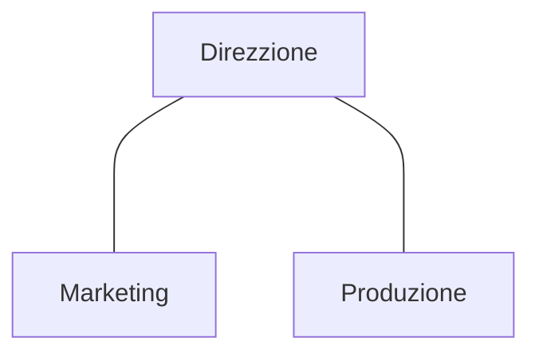
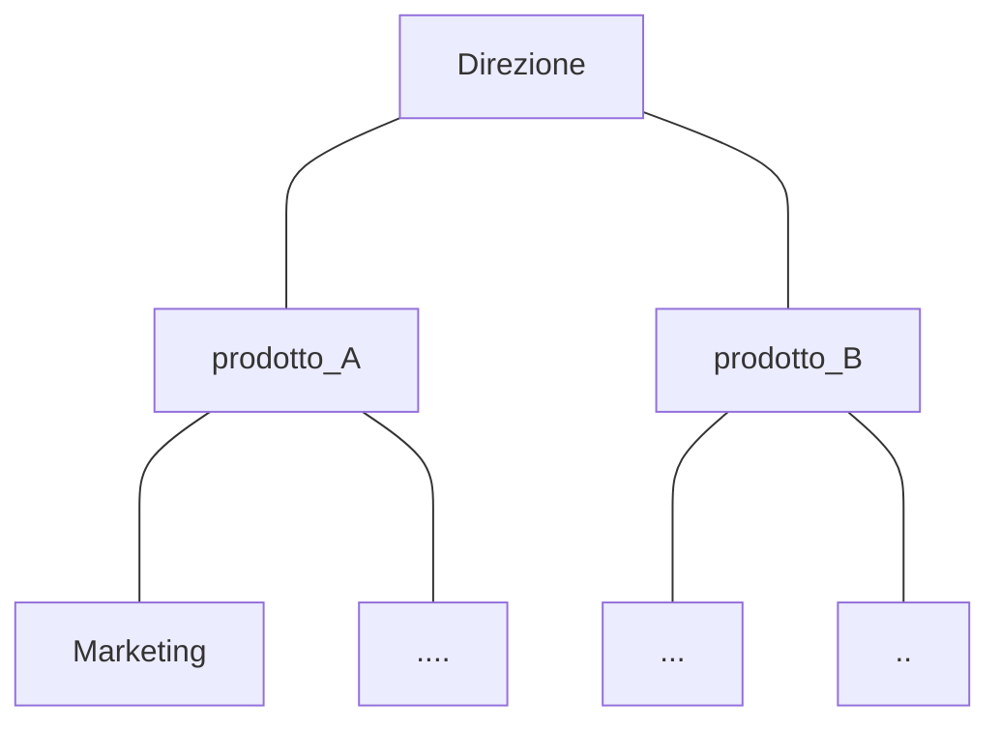

---
tags:
  - CV
---
# Organigramma
In alto livelli più alti
dipendenze linee che collegano 

Tipologie più usate
## Struttura Funzionale
Divisa in base al ruolo

## Struttura divisionale
Funzioni divise per prodotto
Diviso in base alle risorse che servono a quella sezione di business

# Tipologie di aziende
## Azienda di produzione
Produzione di beni
## Aziende di servizi
Offrire servizi
## Aziende Commerciali
Compra e vendita di prodotti
**Senza produzione propria**
# Esercitazione
![[7.1 Esercitazione]]
# Aree funzionali
## Logistica
## Ricerca e Sviluppo
Creare nuovi prodotti e processi
## Acquisti
Chi si occupa di comprare quello che serve all'azienda
## Amministrazione
Paga e gestisce i pagamenti
Più generalmente gestisce la parte economica nell'azienda
## Sistemi informativi
Si occupa di gestire l'hardware e software aziendale
## Risorse umane
Gestione delle assunzioni ecc...
## Marketing
Analisi del mercato e previsione del mercato
# CV
Da mandare alle risorse umane
Competenze conoscenze
Video presentazione
	meno di un minuto